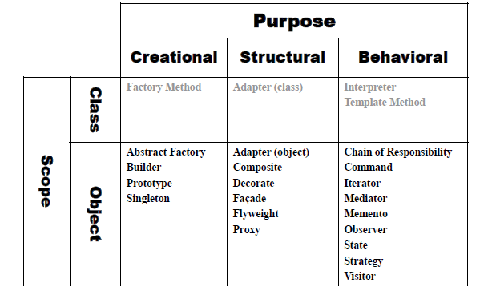

# 1. 디자인 패턴이 무었인가

## 디자인 패턴이 생겨난 이유

- 소프트웨어를 재상용할 수 있고, 유연하고, 확장성 있고, 유지보수가 용이하게 만드는 것은 매우 어려운 일

- 기술, 재능, 노력, 창의성, 직관력 등등이 필요하지만, 무엇보다 경험이 중요

  

## 디자인 패턴이란

 - 디자인 패턴은 소프트웨어 공학의 소프트웨어 디자인에서 특정 문맥에서 공통적으로 발생하는 문제에 대해 재사용 가능한 해결책입니다. 소스나 기계 코드로 바로 전환될수 있는 완성된 디자인은 아니며, 다른 상황에 맞게 사용될 수 있는 문제들을 해결하는데에 쓰이는 서술이나 템플릿입니다.

GoF( Gang of Four) 네 명의 학자가 기존의 많은 사례와 시스템등을 분석하여 **좋은 설계라는 이런것이다** 라는 23개 패턴을 제안 하였지만 좋은 설계를 하기위한 가장 좋은 방법은 무었이냐면 맨 땅에 헤딩을 많이 하면 됩니다.

여러분들이 소프트웨어를 내가 잘만들고 싶다고 해서 내가 굉장히 자바를 잘알고 c++를 잘알고 그렇다고 해서 좋은 설계를 할 수 있냐 그건 아닙니다.
그래서 여러번 만들어보고 유지보수를 하면서 삽질을 해보는거죠. 그러고 나서 "아 이렇게 만들었더니 안되는구나!" 그러고 리펙토링을 또 하고 이 과정을 거쳐가면서 성장하게 되는것입니다.

  

## 그럼 우리가 디자인 패턴을 가지고 소프트웨어를 왜 이렇게 만들어야 하는 이유

시스템을 개발하는데 들어가는 비용과 유지보수에 들어가는 비용을 따져보면 사실 개발보다 유지보수에 들어가는 비용이 더 많이 드는 경우가 있습니다. 

그래서 솔루션을 만들었는데 어느 사이트에 적용을 한다거나 판매를 했더니 거기서 추가적인 요구사항을 원하더라 뭐 DB전체를 바꿔달라 할 수도 있고, 이런 요구사항들을 수용하려면 이미 유연성있는 설계를 해야합니다.

즉 확장성이 있는거죠 결국 유지보수가 좋게 만드는게 가장 중요합니다. 한번 만든 소프트웨어 프로그램이 안변할 수는 없습니다.  아무리 날고 기는 개발자가 만들어도 결국 수정이 되고, 내가 아무리 고려를 한다해도 고객의 요구사항이라는건 우리가 상상 할 수 없기 때문입니다.

그럼 어떻게 만들어야 하나요? 답은 명확합니다. 확장성이 좋게 만들어야됩니다.

확장성이 좋게 만들지 않으면 무슨일이 일어날까요?

개발했던 비용보다 유지보수에 들어가는 비용이 너무 많이 들어갑니다. 이 프로젝트에 많은 인력이 들어가고 사람들이 버전관리하기 어렵고 결국 소스의 여러 버전이 회사에 유지가 되고 이런다고 하면 버그를 패치할 때 일일이 그 소스들을 다 찾아다녀야 하고 그 다음 어디 한군데 고치면 다른 곳에 사이드이펙트가 발생해서 통합테스트를 다시 돌려야 된다던가 해야합니다. 그래서 설계를 잘하는게 굉장히 중요합니다.

  

- Creational : 인스턴스화 할 때 필요한 패턴
- Structural : 구조적인 문제를 해결하는데 필요한 패턴
- Behavioral : 기능적인 문제를 해결하는데 필요한 패턴

스코프를 나눴는데 사실 커다란 의미가 있는건 아니구요. 여러분들이 프로그램을 할 때 이런 부분에서 내가 좀 더 확장성 있게 구현을 할 수 있지 않을까? 라는 고민을 할 수 있게 해봤습니다.

  

## 디자인 패턴은 규칙이 아닙니다.

- 언어에 종속적이지 않구요.

- 프레임 워크 개발에 적용될 수 있습니다.

- 그리고 특정 영역에 종속적이지 않고 일반적으로 활용할 수 있습니다.

  

## 디자인 패턴을 배우면 좋은 점

- 객체 지향을 위한 디자인 패턴은 소프트웨에의 중요한 요소를 향상 시킵니다.

  -- resuse, flexibility, extensibility, modularity

- 디자인 패턴을 사용하면 소프트웨어 개발의 의사소통에 도움이 됩니다.

- 좋은 설계는 좋은 소프트웨어나 오픈소스에 대해 학습하거나, 많은 경험과 연습에 의해 훈련될 수 있기에 
 디자인 패턴을 공부함으로써 이미 증명된 스킬과 경험을 배울수 있습니다.

- 높은 결합도를 가지거나 알고리즘 종속성, 객체의 표현이나 구현에 종속적으로 구현된 소프트웨어의 리펙토링을 가능하게 합니다.

결국 좋은 설계를 유도하여 소프트웨어의 유지보수에 들어가는 비용을 절약할 수 있습니다.
한번 일을 한 것을 잘 재사용하고, 확장성있게 만들고, 코드를 수정 했을때 사이트이펙트를 일으켜서 다른곳에 버그를 발생 시키지 않게 하는, 그리고 기능이 추가됐을 때 이 하나의 기능만 추가되면 되지 다른 곳을 건드리지 않도록 하는 것에 대해 도움이 됩니다.
