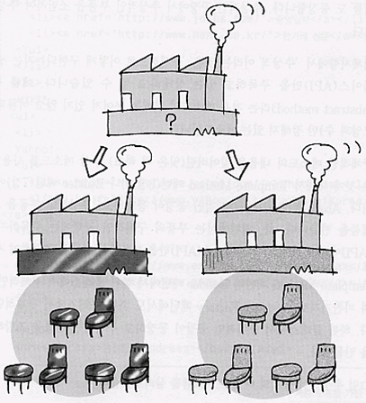
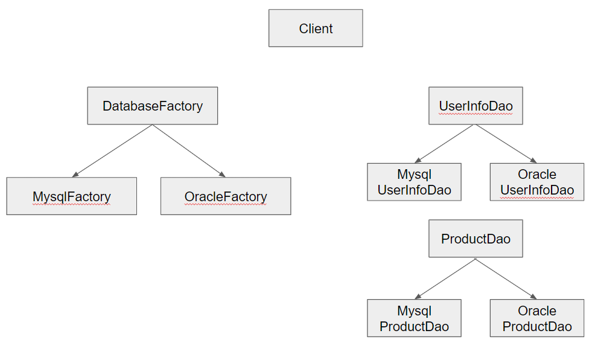
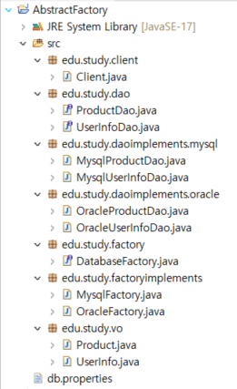

# Abstract Factory Pattern

## 1. Abstract Factory Pattern 이란?

- 여러 제품군을 한꺼번에 생성하는 패턴



## 2. 의도 (Intent)와 동기(Motivation)

-  구체적인 클래스를 생성하지 않고도 서로 관련성이 있거나 독립적인 여러 객체의 군을 생성하기 위한 인터페이스를 제공한다.

-  추상화된 인터페이스 팩토리를 제공하고 상황에 따라 그에 맞는 인스턴스들이 생성되도록 함

      가령 데이터베이스에 따라 DAO클래스가 달라져야 한다고 할 때, 현재 사용해야 하는 DB의 종류에 따른 DAO 인스턴스를 한꺼번에 생성하도록 한다.
  
      위젯을 생성하여 보여줄 때 선택한 옵션에 따라 위젯의 set이 달라질 수 있도록 한다.    

- 생성되고 구성되고 표현되는 방식과 무관하게 시스템을 독립적으로 만들고자 할 때

- 하나 이상의 제품군들 중 하나를 선택하여 시스템을 설정해야 하고 한번 구성한 제품을 다른 것으로 대체할 수 있을 때

## 3. Class diagram


## 4. 객체 협력 (collaborations)

- **AbstractFactory**

  개념적 제품에 대한 객체를 생성하는 오퍼레이션 인터페이스를 정의한다

- **ConcreteFactory**

  구체적인 제품에 대한 객체를 생성하는 오퍼레이션을 구현한다.
  
- **AbstractProduct**

  개념적 제품 객체에 대한 인터페이스를 정의한다. 

- **ConcreteProduct**

  구체적으로 팩토리가 생성할 객체를 정의하고, AbstractProduct 가 정의하고 있는 인터페이스를 구현한다. 


- **Client**

  AbstractFactory 와 AbstractProduct 클래스에 선언된 인터페이스를 사용한다. 

## 5. 중요한 결론 (consequence)

- 일반적으로 ConcreteFactory 클래스의 인스턴스는 실행 할 때 만들어진다.

- 구체적 팩토리는 어떤 특정 구현을 갖는 제품 객체를 생성한다. 서로 다른 제품 객체를 생성하기 위해서 사용자는 서로 다른 ConcretetFactory 를 사용한다. 

- AbstractFactory 는 ConcreteFactory 서브클래스를 통해 필요한 제품 객체를 생성하는 책임을 위임한다.

## 6. 예제


### package


```
package edu.study.factory;

import edu.study.dao.ProductDao;
import edu.study.dao.UserInfoDao;

public interface DatabaseFactory {

	public UserInfoDao createUserInfoDao();
	public ProductDao createProductDao();
	
}
```


```
package edu.study.factoryimplements;

import edu.study.dao.ProductDao;
import edu.study.dao.UserInfoDao;
import edu.study.daoimplements.mysql.MysqlProductDao;
import edu.study.daoimplements.mysql.MysqlUserInfoDao;
import edu.study.factory.DatabaseFactory;

public class MysqlFactory implements DatabaseFactory {

	@Override
	public UserInfoDao createUserInfoDao() {
		return new MysqlUserInfoDao();
	}

	@Override
	public ProductDao createProductDao() {
		return new MysqlProductDao();
	}

}
```


```
package edu.study.factoryimplements;

import edu.study.dao.ProductDao;
import edu.study.dao.UserInfoDao;
import edu.study.daoimplements.oracle.OracleProductDao;
import edu.study.daoimplements.oracle.OracleUserInfoDao;
import edu.study.factory.DatabaseFactory;

public class OracleFactory implements DatabaseFactory {

	@Override
	public UserInfoDao createUserInfoDao() {
		
		return new OracleUserInfoDao();
	}

	@Override
	public ProductDao createProductDao() {
		return new OracleProductDao();
	}

}
```

```
package edu.study.dao;

import edu.study.vo.UserInfo;

public interface UserInfoDao {

	public void insertUserInfo(UserInfo userInfo);
	public void updateUserInfo(UserInfo userInfo);
	public void deleteUserInfo(UserInfo userInfo);
	
}

```


```
package edu.study.daoimplements.mysql;

import edu.study.dao.UserInfoDao;
import edu.study.vo.UserInfo;

public class MysqlUserInfoDao implements UserInfoDao {

	@Override
	public void insertUserInfo(UserInfo userInfo) {
		System.out.println("insert into MYSQL DB productId = " + userInfo.getUserId());
	}

	@Override
	public void updateUserInfo(UserInfo userInfo) {
		System.out.println("update into MYSQL DB productId = " + userInfo.getUserId());
	}

	@Override
	public void deleteUserInfo(UserInfo userInfo) {
		System.out.println("delete from MYSQL DB productId = " + userInfo.getUserId());
	}
}
```

```
package edu.study.daoimplements.oracle;

import edu.study.dao.UserInfoDao;
import edu.study.vo.UserInfo;

public class OracleUserInfoDao implements UserInfoDao {

	@Override
	public void insertUserInfo(UserInfo userInfo) {
		System.out.println("insert into Oracle DB productId = " + userInfo.getUserId());
	}

	@Override
	public void updateUserInfo(UserInfo userInfo) {
		System.out.println("update into Oracle DB productId = " + userInfo.getUserId());
	}

	@Override
	public void deleteUserInfo(UserInfo userInfo) {
		System.out.println("delete from Oracle DB productId = " + userInfo.getUserId());
	}
}
```

```
package edu.study.dao;

import edu.study.vo.Product;

public interface ProductDao {

	public void insertProduct(Product product);
	public void updateProduct(Product product);
	public void deleteProduct(Product product);
	
}
```

```
package edu.study.daoimplements.mysql;

import edu.study.dao.ProductDao;
import edu.study.vo.Product;

public class MysqlProductDao implements ProductDao {

	@Override
	public void insertProduct(Product product) {
		System.out.println("insert into MYSQL DB productId = " + product.getProductId());
	}

	@Override
	public void updateProduct(Product product) {
		System.out.println("update into MYSQL DB productId = " + product.getProductId());
	}

	@Override
	public void deleteProduct(Product product) {
		System.out.println("delete from MYSQL DB productId = " + product.getProductId());
	}

}
```

```
package edu.study.daoimplements.oracle;

import edu.study.dao.ProductDao;
import edu.study.vo.Product;

public class OracleProductDao implements ProductDao {

	@Override
	public void insertProduct(Product product) {
		System.out.println("insert into ORACLE DB productId = " + product.getProductId());
	}

	@Override
	public void updateProduct(Product product) {
		System.out.println("update into ORACLE DB productId = " + product.getProductId());
	}

	@Override
	public void deleteProduct(Product product) {
		System.out.println("delete from ORACLE DB productId = " + product.getProductId());
	}

}
```

```
package edu.study.vo;

public class Product {

	private String productId;
	private String productName;

	public String getProductId() {
		return productId;
	}

	public void setProductId(String productId) {
		this.productId = productId;
	}

	public String getProductName() {
		return productName;
	}

	public void setProductName(String productName) {
		this.productName = productName;
	}

}
```

```
package edu.study.vo;

public class UserInfo {

	private String userId;
	private String password;
	private String userName;

	public String getUserId() {
		return userId;
	}

	public void setUserId(String userId) {
		this.userId = userId;
	}

	public String getPassword() {
		return password;
	}

	public void setPassword(String password) {
		this.password = password;
	}

	public String getUserName() {
		return userName;
	}

	public void setUserName(String userName) {
		this.userName = userName;
	}

}
```

```
package edu.study.client;

import java.io.FileInputStream;
import java.io.FileNotFoundException;
import java.io.IOException;
import java.util.Properties;

import edu.study.dao.ProductDao;
import edu.study.dao.UserInfoDao;
import edu.study.factory.DatabaseFactory;
import edu.study.factoryimplements.MysqlFactory;
import edu.study.factoryimplements.OracleFactory;
import edu.study.vo.Product;
import edu.study.vo.UserInfo;

public class Client {

	public static void main(String[] args) throws FileNotFoundException, IOException {
		
		FileInputStream fis = new FileInputStream("db.properties");
		Properties prop = new Properties();
		prop.load(fis);
		
		String dbType = prop.getProperty("DBTYPE");
		
		UserInfo userInfo = new UserInfo();
		userInfo.setUserId("12345");
		userInfo.setPassword("!@#$%");
		userInfo.setUserName("이성계");
		
		Product product = new Product();
		product.setProductId("0011AA");
		product.setProductName("TV");
		
		DatabaseFactory databaseFactory = null;
		
		// 데이터베이스 선택.
		if (dbType.equals("MYSQL")) {
			databaseFactory = new MysqlFactory();
		}
		else if (dbType.equals("ORACLE")) {
			databaseFactory = new OracleFactory();
		}
		else {
			// 예외 핸들링이 필요.. (여기선 시스아웃으로 대체하겠습니다.)
			System.out.println("error");
			// return;
		}
		
		System.out.println("========== UserInfo TRANSACTION ==========");
		UserInfoDao userInfoDao = databaseFactory.createUserInfoDao();
		userInfoDao.insertUserInfo(userInfo);
		userInfoDao.updateUserInfo(userInfo);
		userInfoDao.deleteUserInfo(userInfo);
		
		
		System.out.println("========== ProductInfo TRANSACTION ==========");
		ProductDao productDao = databaseFactory.createProductDao();
		productDao.insertProduct(product);
		productDao.updateProduct(product);
		productDao.deleteProduct(product);
	}
}
```


```
db.properties

DBTYPE=ORACLE
```