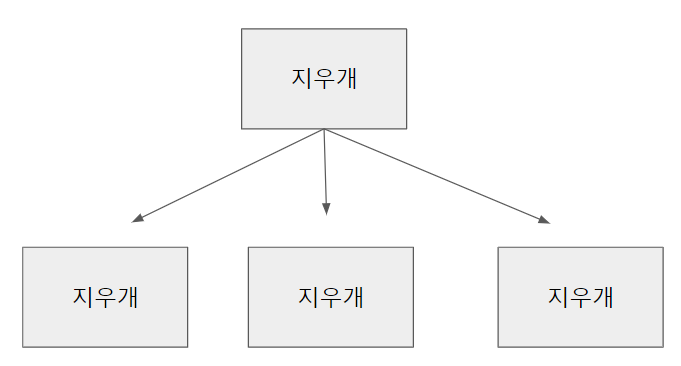
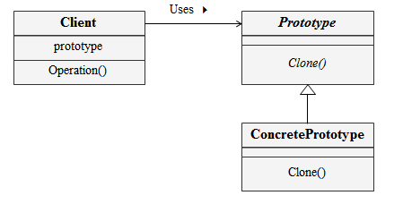
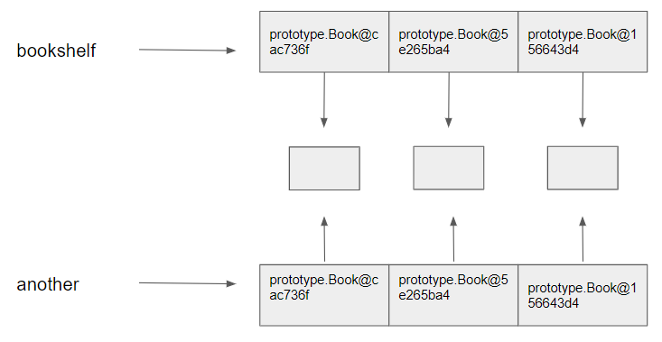
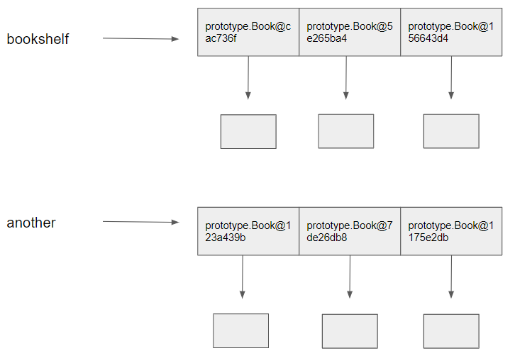

# Prototype Pattern

## 1. Prototype Pattern 이란?

- 복제해서 인스턴스를 만드는 패턴



## 2. 의도 (Intent)와 동기(Motivation)

-  클래스의 인스턴스가 생성과정이 복잡하거나 여러 조합에 의해 생성되어야 하는경우 하나의 견본(prototype)을 만들어 

   초기화해두고 이를 복제해서 객체를 생성하는 방법 


## 3. Class diagram



## 4. 객체 협력 (collaborations)

- 복제하는데 필요한 

## 5. 중요한 결론 (consequence)

- 프로토타입 속성값을 활용하여 다양한 객체를 생성할 수 있음

- 서브클래스의 수를 줄일 수 있다. 

- 자바에서는 clone() 메서드를 재정의하여 구현한다.

## 6. 예제 

### 얕은복사
인스턴스의 주소만 복사 하기 때문에 another도 bookshelf와 같은 객체를 가리킵니다. another.get(i) == bookshelf.get(i)



### 깊은복사
bookshelf를 복사하고 bookshelf안에 있는 book 까지 복제를 하고싶다면 super.clone() 으로는 인스턴스의 주소값만 복사가 이루어지니
Object class에서 제공해주는 clone() 메서드를 오버라이딩 해야합니다.


```

import java.util.ArrayList;
// 프로토타입: 견본 또는 샘플을 얘기함.
// 프로토타입 패턴: 하나의 샘플클래스를 만들어 샘플클래스를 복제해서 사용하는 패턴
/**
 * 자바에서는 객체를 생성할 때 new 키워드를 이용해서 객체를 생성 하는데 어떠한 경우에는 객체 생성 과정이 복잡한 객체가 있을 수 있습니다. 즉 단일 객체가 아니라 여러 객체가 모여져 있는 경우
 * 이런 경우는 그 객체까지 만들어지는 생성 과정이 여러 단계일 수 있습니다. 가령 디비에서 가져온 데이터를 어떠한 객체가 가지고 있는데 이 데이터와 같은 데이터를 또 만들어야 한다 던가 그러면
 * 매번 디비에서 가져와서 ArrayList를 만들다라던가 이런 일들은 복잡한 일들이 됩니다. 이런 일들 외에도 객체를 만드는데 복잡한 과정이 들어가는 여러가지 경우들이 있을 수 있습니다.
 * 그래서 이런 경우에는 보통 복제를 하는 방법을 사용합니다. 
 * @author hyungtaekim
 *
 */
class Book {
	
	private String author;
	private String title;
	
	public Book(String author, String title) {
		this.author = author;
		this.title = title;
	}

	public String getAuthor() {
		return author;
	}

	public void setAuthor(String author) {
		this.author = author;
	}

	public String getTitle() {
		return title;
	}

	public void setTitle(String title) {
		this.title = title;
	}
	
	@Override
	public String toString() {
		return "(" + author + "," + title + ")";
	}
}

/**
 * BookShelf 객체가 Cloneable 하다. 즉 복제해도 된다 라고 명시하는 것입니다.
 * Cloneable interface 라고 하면 그 내부에 clone 메소드가 선언되어 있는 것처럼 생각하기 쉽습니다. 
 * 그러나 Cloneable 인터페이스에는 메소드가 하나도 선언되어 있지 않습니다. 이 인터페이스는 단지 "clone 에 의해 복사할 수 있다" 라는 표시로서 사용되고 있습니다.
 * 이와 같은 표시를 하는 인터페이스를 marker interface라고 합니다.
 *
 */
class BookShelf implements Cloneable {
	
	private ArrayList<Book> shelf;
	
	public BookShelf() {
		shelf = new ArrayList<Book>();
	}

	public ArrayList<Book> getShelf() {
		return shelf;
	}

	public void setShelf(ArrayList<Book> shelf) {
		this.shelf = shelf;
	}
	
	public void add(Book book) {
		shelf.add(book);
	}
	
	
	@Override
	public String toString() {
		return shelf.toString();
	}
	
	
	/*
	@Override
	protected Object clone() throws CloneNotSupportedException {
		
		// 얕은복사
		return super.clone();
	}
	*/
	
	@Override
	protected Object clone() throws CloneNotSupportedException {
		
		// 깊은복사 (사용자 정의)
		BookShelf another = new BookShelf();
		
		for (int i = 0; i < shelf.size(); i++) {
			another.add(new Book(shelf.get(i).getAuthor(), shelf.get(i).getTitle()));
		}
		
		return another;
	}
}

public class PrototypeTest {

	public static void main(String[] args) throws CloneNotSupportedException {
		
		// 책장에 책들을 꼳을겁니다. 그러면 책장이지만 그 안에 책이라는 객체를 갇고 있는 복합 객체가 됩니다.
		// 견본(샘플)
		BookShelf bookShelf = new BookShelf();
		bookShelf.add(new Book("저자1", "책제목1"));
		bookShelf.add(new Book("저자2", "책제목2"));
		bookShelf.add(new Book("저자3", "책제목3"));
		
		// 복제를 할 때 자바에는 clone() 이라는 메서드가 Object 클래스에 있습니다. 그래서 자바의 모든 클래스는 Object 크래스를 상속을 받기 때문에 clone() 메서드를 사용할 수 있습니다.
		
		/**
		 * clone() 메서드를 사용하기 위해서는 clone() 메서드를 오버라이딩 해야한다.
		 * 그리고 clone() 메서드를 사용하기 위해서는 Cloneable 인터페이스를 선언 해줘야 합니다. 
		 * Exception 발생 이유: Cloneable을 하지 않았는데 clone을 하냐에 대한 예외 발생. 예외 핸들링 필요.
		 */
		BookShelf another = (BookShelf) bookShelf.clone();
		
		bookShelf.getShelf().get(0).setAuthor("저자9999");
		bookShelf.getShelf().get(0).setTitle("책제목9999");
		
		System.out.println(bookShelf);
		System.out.println(another);
		
		/**
		 * 키포인트
		 * 어떠한 객체에 여러개의 객체가 포함되어있는 경우 프로토타입을 두고 복제가 가능하다.
		 * 자바에서는 clone()을 사용할 수 있다.
		 * 클론을 할 때 객체 복사 부분에서는 객체가 객체를 포함한 상태에서는 주소만 복사가 될 수 있기 때문에 이부분은 한번더 체크를 해야 한다.
		 */
	}
}

```