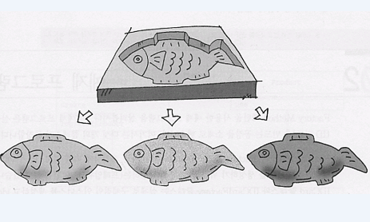
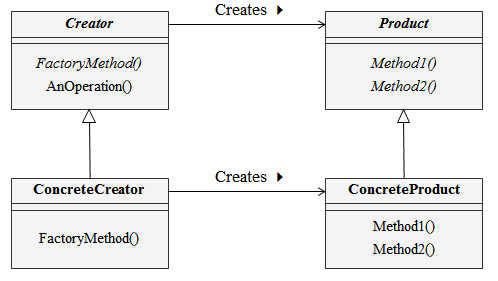

# Factory Method Pattern

## 1. Factory Method Pattern 이란?

- 인스턴스 작성을 하위 클래스에게 위임.

- Template Method 패턴을 인스턴스 생성에 적용



## 2. 의도 (Intent)와 동기(Motivation)

- 객체를 생성하기 위한 인터페이스를 정의하지만, 어떤 클래스의 인스턴스를 생성할지에 대한 결정은 서브클래스에서 결정하게 함.

- 여러 상황에 따라 각각 생성될 수 있는 객체에 대한 생성을 하위 클래스에 위임

- 생성과 관련된 동일한 메서드는 상위 클래스에서 처리
    
## 3. Class diagram


## 4. 객체 협력 (collaborations)

- Product

 팩토리 메소드가 생성하는 객체의 인터페이스를 정의한다.

- ConcreteProduct

 Product 클래스에 정의된 인터페이스를 실제로 구현한다.

- Creator

 Product 타입의 객체를 반환하는 팩토리 메소드를 선언한다. Creator 클래스는 팩토리 메소드를 기본적으로 구현하는데, 이 구현에서는 ConcreateProduct 객체를 반환한다. 

 Product 객체의 생성을 위해 팩토리 메소드를 호출한다.

- ConcreteCreator

ConcreteProduct 의 인스턴스를 반환하기 위해 팩토리 메소드를 재정의 한다.


## 5. 중요한 결론 (consequence)

- 상황에 따라 다양한 인스턴스 생성을 할 수 있음


## 6. 예제

```
public abstract class Car {

	String carType;
	
	public String toString() {
		return carType;
	}
}
```

```
public abstract class CarFactory {
	
	public abstract Car createCar(String name);

	public abstract Car returnCar(String name);
	
	public void numbering() {
		System.out.println("numbering");
	}
	
	public void washCar() {
		System.out.println("washCar");
	}
	
	final public void sellCar(String name) {
		
		numbering();
		createCar(name);
		washCar();
	}
}
```

```
public class HyundaiCarFactory extends CarFactory {

	HashMap<String, Car> carMap = new HashMap<String, Car>();
	
	@Override
	public Car createCar(String name) {

		Car car = null;
		
		if (name == "sonata") {
			car = new Sonata();
		}
		else if (name == "santafe") {
			car = new Santafe(); 
		}
		 
		return car;
	}

	public Car returnCar(String name) {
		
		// Jame는 Sonata, Tomas는 Santafe 인 경우
		
		Car car = carMap.get(name);
		if (car == null) {
			
			if (name.equals("Tomas")) {
				car = new Sonata();
			}
			else if (name.equals("James")) {
				car = new Santafe();
			}
		}
		carMap.put(name, car);
		return car;
	}
}
```

```
public class Santafe extends Car {

	public Santafe() {
		carType = "Santafe";
	}
}

```

```
public class Sonata extends Car {

	public Sonata() {
		carType = "Sonata";
	}
}

```

```
public class CarTest {

	public static void main(String[] args) {

		CarFactory factory = new HyundaiCarFactory();
		Car newCar = factory.createCar("sonata");
		
		System.out.println(newCar);
		
		Car myCar = factory.returnCar("Tomas");
		Car hisCar = factory.returnCar("Tomas");
		
		System.out.println(myCar == hisCar);
	}
}
```