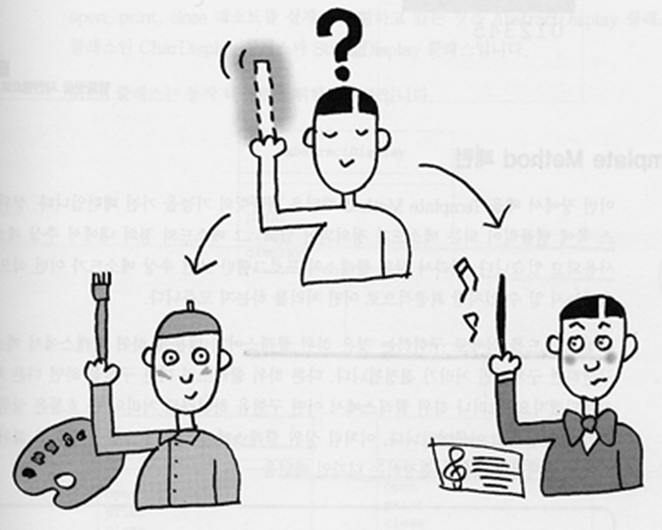
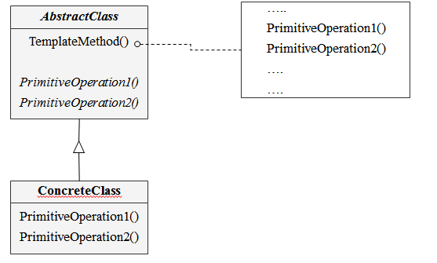
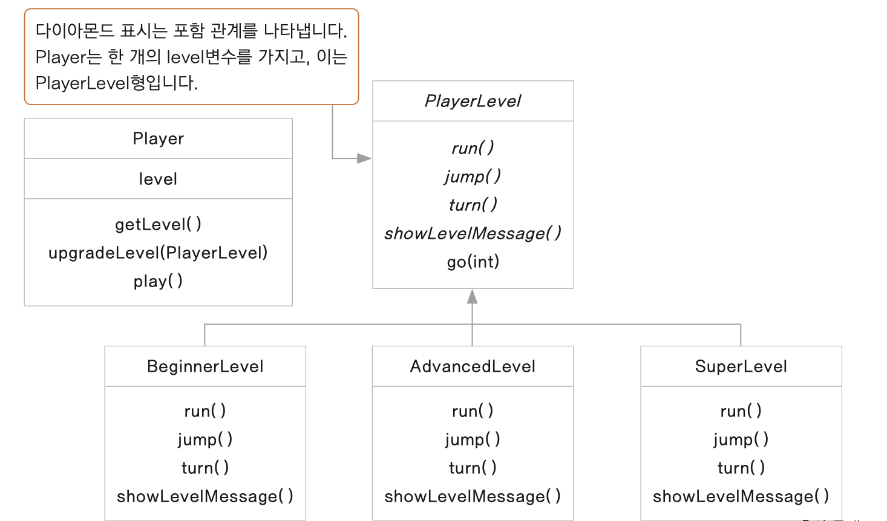

# Template Method Pattern

## 1. Template Method Pattern 이란?

- 상위 클래스에서는 전체적인 흐름을 구현하고 
- 


## 2. 의도 (Intent)와 동기(Motivation)

- Operation 에  알고리즘의 기본 골격 구조를 정의하고 구체적인 단계는 서브클래스에 정의한다

- 추상화된 함수를 통해서 알고리즘의 일부 단계를 정의함으로써 템플릿 메소드의 처리순서를 정할 수 있다. 
  
## 3. Class diagram



## 4. 객체 협력 (collaborations)

- **AbstractClass**

 서브 클래스들이 반드시 구현해야 하는 알고리즘 처리 단계 내의 기본 오퍼레이션이 무엇인지를 정의한다. 서브 클래스에서 이들 오퍼레이션들을 구현한다.

- **ConcreteClass**

 상위 클래스에서 선언된 추상 메서드를 구현하거나 이미 구현된 메서드를 재정의한다

## 5. 중요한 결론 (consequence)

- 템플릿 메소드는 코드 재사용을 위한 기본 기술

- 프레임워크에서 가장 많이 사용되는 패턴 중 하나

- 클래스의 공통부분을 분리하는 기능 제공

- 템플릿 메서드에서 사용하는 오퍼레이션들

    ConcreteClass  오퍼레이션이나 클라이언트 클래스에 정의된 오퍼레이션

    AbstractClass 에 정의된 오퍼레이션 중 구체적인 알고리즘을 가지고 있는 오퍼레이션
    
    기본 오퍼레이션으로 추상화된 오퍼레이션

    훅 오퍼레이션

## 6. 예제 


```
public class Player {

	private PlayerLevel level;
	
	public Player() {
		// 처음엔 초급자 레벨
		level = new BeginnerLevel();
		level.showLevelMessage();
	}
	
	// 레벨 업
	public void upgradeLevel(PlayerLevel level) {
		level.showLevelMessage();
		this.level = level;
	}
	
	public void play(int count) {
		level.go(count);
	}
	
	public PlayerLevel getPlayLevel() {
		return level;
	}
}
```

```
public class BeginnerLevel extends PlayerLevel {

	@Override
	public void run() {
		System.out.println("천천히 달립니다.");
		
	}

	@Override
	public void jump() {
		System.out.println("Jump 할 줄 모릅니다.");
	}

	@Override
	public void turn() {
		System.out.println("Turn 할 줄 모릅니다.");		
	}

	@Override
	public void showLevelMessage() {
		System.out.println("***** 초보자 레벨 입니다. *****");
	}
}
```

```
public class AdvancedLevel extends PlayerLevel {
	
	@Override
	public void run() {
		System.out.println("빨리 달립니다.");

	}

	@Override
	public void jump() {
		System.out.println("높이 jump 합니다.");
	}

	@Override
	public void turn() {
		System.out.println("Turn 할 줄 모릅니다.");
	}

	@Override
	public void showLevelMessage() {
		System.out.println("***** 중급자 레벨 입니다. *****");
	}
}
```

```
public class SuperLevel extends PlayerLevel {

	@Override
	public void run() {
		System.out.println("엄청 빨리 달립니다.");
		
	}

	@Override
	public void jump() {
		System.out.println("아주 높이 jump 합니다.");
	}

	@Override
	public void turn() {
		System.out.println("한 바퀴 돕니다.");		
	}

	@Override
	public void showLevelMessage() {
		System.out.println("***** 고급자 레벨 입니다. *****");
	}

	// 훅 메서드: 필요에 따라서 하위 클래스가 오버라이딩 하여 사용하고, 더 확장성 있게 제공을 합니다.
	@Override
	public void fly() {
		System.out.println("엄청 높이 날아갑니다.");
	}
}
```

```
public class Player {

	private PlayerLevel level;
	
	public Player() {
		// 처음엔 초급자 레벨
		level = new BeginnerLevel();
		level.showLevelMessage();
	}
	
	// 레벨 업
	public void upgradeLevel(PlayerLevel level) {
		level.showLevelMessage();
		this.level = level;
	}
	
	public void play(int count) {
		level.go(count);
	}
	
	public PlayerLevel getPlayLevel() {
		return level;
	}
}
```

```
public class Main {

	public static void main(String[] args) {

		Player player = new Player();
		player.play(1);
		
		PlayerLevel level = new AdvancedLevel();
		player.upgradeLevel(level);
		 
		player.play(2);
		
		level = new SuperLevel();
		player.upgradeLevel(level);
		player.play(5);
	}
}
```