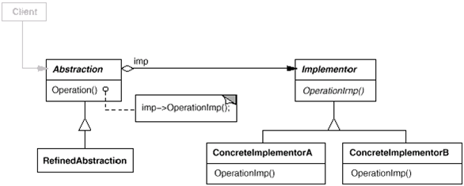
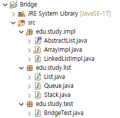

# Bridge Pattern

## 1. Bridge Pattern 이란?

- 기능의 계층과 구현의 계층을 분리함

- 추상화와 구현을 분리하여 각각을 독립적으로 변경할 수 있게 함

## 2. 의도 (Intent)와 동기(Motivation)

- 기능의 확장과 구현의 확장을 따로 계층화 함

- 기능에 대한 여러가지 구현을 다양하게 적용할 수 있음

- 기능과 구현이 혼재하면 상속의 관계가 복잡해짐

- 두 계층을 분리하고 서로의 사이에 다리(Bridge)가 필요함
  

## 3. Class diagram



## 4. 객체 협력 (collaborations)

- Abstraction (List) 

  - 추상화 개념의 상위 클래스이고 객체 구현자(Implemntor)에 대한 참조자를 관리

- RefinedAbstraction (Stack, Queue)

  - 추상화 개념의 확장된 기능을 정의

- Implementor (AbstractList)

  - 구현 클래스에 대한 선언을 제공

  - 하위 클래스가 구현해야 하는 기능들을 선언한다. (자바의 인터페이스)

  - Implementor와 Abstraction의 메서드 이름은 서로 다를 수 있다.

- ConcreteImplementor ( Array, LinkedList )

  - Implementor에 선언된 기능을 실제로 구현한다. 여러 구현방식의 클래스가 만들어 질 수 있다.

## 5. 중요한 결론 (consequence)

- 기능과 구현의 결합도 약하므로, 기능이 구현 방식에 얽매이지 않는다.

- 기능의 구현 클래스를 런타임때 지정할 수도 있다.

- 구현이 변경되더라도 기능 클래스 부분에 대한 컴파일은 필요없다.

- 기능과 구현은 독립적으로 확장되며, 클라이언트는 기능의 인터페이스를 사용하므로 구체적인 구현내용은 숨길 수 있다.

## 6. Related Pattern

- Abstract Factory : 특정 브리지를 생성하고 합성할 수 있다.

- Adapter : 서로 관련없는 클래스들이 연결 될 수 있다.

## 7. 예제 

- List는 선형 자료구조 입니다. 그 중에는 Stack, Queue, Deque와 같이 특정 기능을 제공하는 자료구조가 있습니다.

- List를 구현하는 방법은 크게 Array와 LinkedList 가 있습니다. 

- 가령 하나의 Stack을 구현한다고 할 때 Array로 구현 할 수도 있고, LinkedList로 구현할 수도 있습니다.

- Bridge Pattern을 활용하여 구현해 보세요


## package



```
package edu.study.impl;

public interface AbstractList<T> {
	public void addElement(T obj);
	public T deleteElement(int i);
	public int insertElement(T obj, int i);
	public T getElement(int i);
	public int getElementSize();
}
```

```
package edu.study.impl;

import java.util.ArrayList;
import java.util.LinkedList;

public class ArrayImpl<T> implements AbstractList<T> {

	ArrayList<T> array;

	public ArrayImpl() {
		array = new ArrayList<T>();
	}
	
	@Override
	public void addElement(T obj) {
		array.add(obj);
	}

	@Override
	public T deleteElement(int i) {
		return array.remove(i);
	}

	@Override
	public int insertElement(T obj, int i) {
		array.add(i, obj);
		return i;
	}

	@Override
	public T getElement(int i) {
		return array.get(i);
	}

	@Override
	public int getElementSize() {
		return array.size();
	}

	public String toString() {
		return array.toString();
	}
}
```

```
package edu.study.impl;

import java.util.LinkedList;

public class LinkedListImpl<T> implements AbstractList<T> {

	LinkedList<T> linkedList;
	
	public LinkedListImpl() {
		linkedList = new LinkedList<T>();
	}
	
	@Override
	public void addElement(T obj) {
		linkedList.add(obj);
	}

	@Override
	public T deleteElement(int i) {
		return linkedList.remove(i);
	}

	@Override
	public int insertElement(T obj, int i) {
		linkedList.add(i, obj);
		return i;
	}

	@Override
	public T getElement(int i) {
		return linkedList.get(i);
	}

	@Override
	public int getElementSize() {
		return linkedList.size();
	}

	public String toString() {
		return linkedList.toString();
	}
}
```

```
package edu.study.list;

import edu.study.impl.AbstractList;

public abstract class List<T> {
	
	AbstractList<T> impl;
	
	public List(AbstractList<T> list) {
		impl = list;
	}
	
	public void add(T obj) {
		impl.addElement(obj);
	}
	
	public T remove(int i) {
		return impl.deleteElement(i);
	}
	
	public T get(int i) {
		return impl.getElement(i);
	}
	
	public int getSize() {
		return impl.getElementSize();
	}
	
	public String toString() {
		return impl.toString();
	}
}
```

```
package edu.study.list;

import edu.study.impl.AbstractList;

public class Queue<T> extends List<T> {

	public Queue(AbstractList<T> list) {
		super(list);
	}
	
	public void enQueue(T obj) {
		impl.addElement(obj);
	}
	
	public T deQueue() {
		return impl.deleteElement(0);
	}
}
```

```
package edu.study.list;

import edu.study.impl.AbstractList;

public class Stack<T> extends List<T> {

	public Stack(AbstractList<T> list) {
		super(list);
	}

	public void push(T obj) {
		impl.insertElement(obj, 0);
	}
	
	public T pop() {
		return impl.deleteElement(0);
	}
}

```

```
package edu.study.test;

import edu.study.impl.ArrayImpl;
import edu.study.impl.LinkedListImpl;
import edu.study.list.Queue;
import edu.study.list.Stack;

public class BridgeTest {

	public static void main(String args[]) {

		Stack<String> linkedListStack = new Stack<String>(new LinkedListImpl<String>());

		linkedListStack.push("aaa");
		linkedListStack.push("bbb");
		linkedListStack.push("ccc");

		System.out.println(linkedListStack.toString());
		System.out.println(linkedListStack.pop());
		System.out.println(linkedListStack.pop());
		System.out.println(linkedListStack.pop());
		System.out.println("==========================");

		Stack<String> arrayListStack = new Stack<String>(new ArrayImpl<String>());

		arrayListStack.push("aaa");
		arrayListStack.push("bbb");
		arrayListStack.push("ccc");

		System.out.println(arrayListStack.toString());
		System.out.println(arrayListStack.pop());
		System.out.println(arrayListStack.pop());
		System.out.println(arrayListStack.pop());
		System.out.println("==========================");

		Queue<String> arrayQueue = new Queue<String>(new ArrayImpl<String>());

		arrayQueue.enQueue("aaa");
		arrayQueue.enQueue("bbb");
		arrayQueue.enQueue("ccc");

		System.out.println(arrayQueue.toString());
		System.out.println(arrayQueue.deQueue());
		System.out.println(arrayQueue.deQueue());
		System.out.println(arrayQueue.deQueue());
		System.out.println("==========================");

		Queue<String> linkedQueue = new Queue<String>(new LinkedListImpl<String>());

		linkedQueue.enQueue("aaa");
		linkedQueue.enQueue("bbb");
		linkedQueue.enQueue("ccc");

		System.out.println(linkedQueue.toString());
		System.out.println(linkedQueue.deQueue());
		System.out.println(linkedQueue.deQueue());
		System.out.println(linkedQueue.deQueue());
	}
}
```