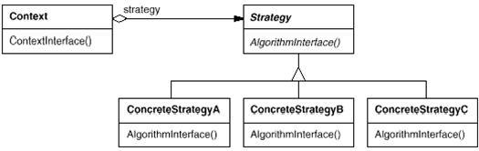
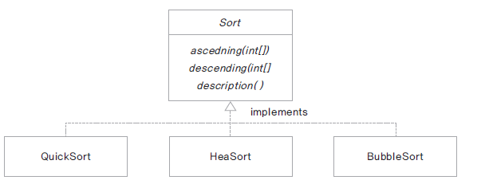
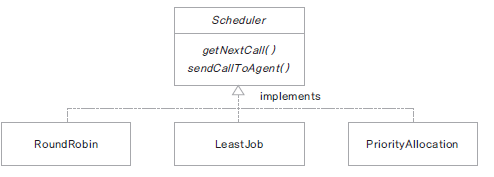

# Strategy Pattern

## 1. Strategy Pattern 이란?

- 정책이나 알고리즘을 교체하여 사용할 수 있음


## 2. 의도 (Intent)와 동기(Motivation)

- 다양한 알고리즘이 존재하면 이들 각각을 하나의 클래스로 캡슐화하여 알고리즘의 대체가 가능하도록 한다.

- 클라이언트와 독립적인 다양한 알고리즘을 적용할 수 있도록 한다.

- 사용자가 모르고 있는 데이터를 사용하여 여러 정책들이 반영될 수 있도록 구현
    
- 여러 정책이 수행되어야 하는 조건들 (if-else, switch) 문이 없어질 수 있다

## 3. Class diagram


## 4. 객체 협력 (collaborations)

- Strategy 

  - 정책이 수행해야 하는 기능들을 인터페이스로 선언

- ConcreteStrategy 

  - Strategy에 선언된 여러 기능들을 구현

  - 다양한 정책들이 구현될 수 있음

- Context

  - 어떤 ConcreteStrategy 가 수행 될 것인지에 따라 정책을 선택한다

  - Strategy에 선언된 메서드 기반으로 접근한다.

  - Strategy 클래스와 Context 클래스는 선택한 알고리즘이 동작하도록 협력한다.

## 5. 중요한 결론 (consequence)

- 인터페이스에 선언된 기능을 구현한 다양한 정책을 다른 클래스에 영향을 주지 않고 추가, 삭제 할 수 있다.

- 각 기능에서 if -else 조건문을 구현하는 것이 아닌 정책 클래스를 선택하도록 구현하여 유지보수가 용이하다

## 6. Related Pattern

- Strategy Pattern 의 클래스가 작은 규모일 경우 Flyweight 패턴으로 정의 하는 것이 좋다



## 7. 예제 

    고객 센터에 전화 상담을 하는 상담원들이 있습니다. 
    일단 고객센터로 전화가 들어오면 대기열에 저장됩니다. 
    상담원이 지정되기 전까지 대기 상태가 됩니다. 
    각 고객의 전화를 상담원에게 배분하는 정책은 다음과 같이 여러 방식으로 구현될 수 있습니다.

    1. 순서대로 배분하기 : 
       모든 상담원이 동일한 건수를 처리하도록 들어오는 순서대로 배분합니다.
    2. 짧은 대기열을 찾아 배분하기 : 
       고객 대기 시간을 줄이기 위해 상담을 하지 않는 상담원이나 가장 짧은 대기 열을 보유한 상담원에게 배분합니다.
    3. 우선 순위에 따라 배분하기 : 
       고객의 등급에 따라 등급이 높은 고객의 전화를 우선 가져와 업무 능력이 좋은 상담원에게 우선 배분 합니다. 



Scheduler.java
```
package edu.study.scheduler;

public interface Scheduler {

	// 콜을 어떻게 가져올 것인가.
	public abstract void getNextCall();
	
	// 상담원에게 콜을 어떻게 줄것인가.
	public abstract void sendCallToAgent();
}
```

RoundRobin.java
```
package edu.study.scheduler;

public class RoundRobin implements Scheduler {

	@Override
	public void getNextCall() {
		System.out.println("상담 전화를 순서대로 대기열에서 가져옵니다.");
	}

	@Override
	public void sendCallToAgent() {
		System.out.println("다음 순서 상담원에게 배분합니다.");
	}
}
```

LeastJob.java
```
package edu.study.scheduler;

public class LeastJob implements Scheduler {

	@Override
	public void getNextCall() {
		System.out.println("상담 전화를 순서대로 대기열에서 가져옵니다.");
	}

	@Override
	public void sendCallToAgent() {
		System.out.println("현재 상담업무가 없거나 상담대기가 가장 작은 상담원에게 할당합니다.");
	}
}
```

PriorityAllocation.java
```
package edu.study.scheduler;

public class PriorityAllocation implements Scheduler {

	@Override
	public void getNextCall() {
		System.out.println("고객 등급이 높은 고객의 전화를 먼저 가져옵니다.");
	}

	@Override
	public void sendCallToAgent() {
		System.out.println("업무 skill이 높은 상담원에게 우선적으로 배분합니다.");
	}
}
```

AgentGetCall.java
```
package edu.study.scheduler;

public class AgentGetCall implements Scheduler {

	@Override
	public void getNextCall() {
		System.out.println("상담원이 다음 전화 요청.");
	}

	@Override
	public void sendCallToAgent() {
		System.out.println("상담원이 전화 상담을 가져갔습니다.");
	}
}
```

SchedulerExample.java
```
package edu.study.scheduler;

import java.io.IOException;

public class SchedulerExample {
	
	public static void main(String[] args) throws IOException {
		
		System.out.println("전화 상담 할당 방식을 선택 하세요.");
		System.out.println("R : 한명씩 차례로 할당.");
		System.out.println("L : 한명씩 차례로 할당.");
		System.out.println("P : 우선순위가 높은 고객 먼저 할당.");
		// System.out.println("A : 상담원이 상담 가져가기.");
		
		int ch = System.in.read();
		
		Scheduler schduler = null;
		if (ch == 'r' || ch == 'R') {
			schduler = new RoundRobin();
		}
		else if (ch == 'l' || ch == 'L') {
			schduler = new LeastJob();
		}
		else if (ch == 'p' || ch == 'P') {
			schduler = new PriorityAllocation();
		}
		else if (ch == 'a' || ch == 'A') {
			schduler = new AgentGetCall();
		}
		else {
			System.out.println("not support");
			return;
		}
		
		schduler.getNextCall();
		schduler.sendCallToAgent();
	}
}
```